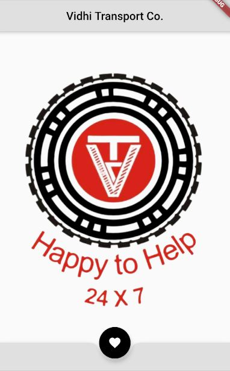

# vidhitransport

A new or my first Flutter application.
Its just a home page or an one page app , I am here to upload my path towards flutter devlopment and share that.
Goal is to develop a fully fleshed ios/andriod app at the end. So the final version would be something very workfull

work left
-add icon image for main menu of device and add an image asset to it
-goal to have a app which gets data of the trucks from the API and display the details and track location

## here is the preview of what I developed

## Getting Started

This project is a starting point for a Flutter application.

A few resources to get you started if this is your first Flutter project:

- [Lab: Write your first Flutter app](https://flutter.dev/docs/get-started/codelab)
- [Cookbook: Useful Flutter samples](https://flutter.dev/docs/cookbook)

For help getting started with Flutter, view our
[online documentation](https://flutter.dev/docs), which offers tutorials,
samples, guidance on mobile development, and a full API reference.
